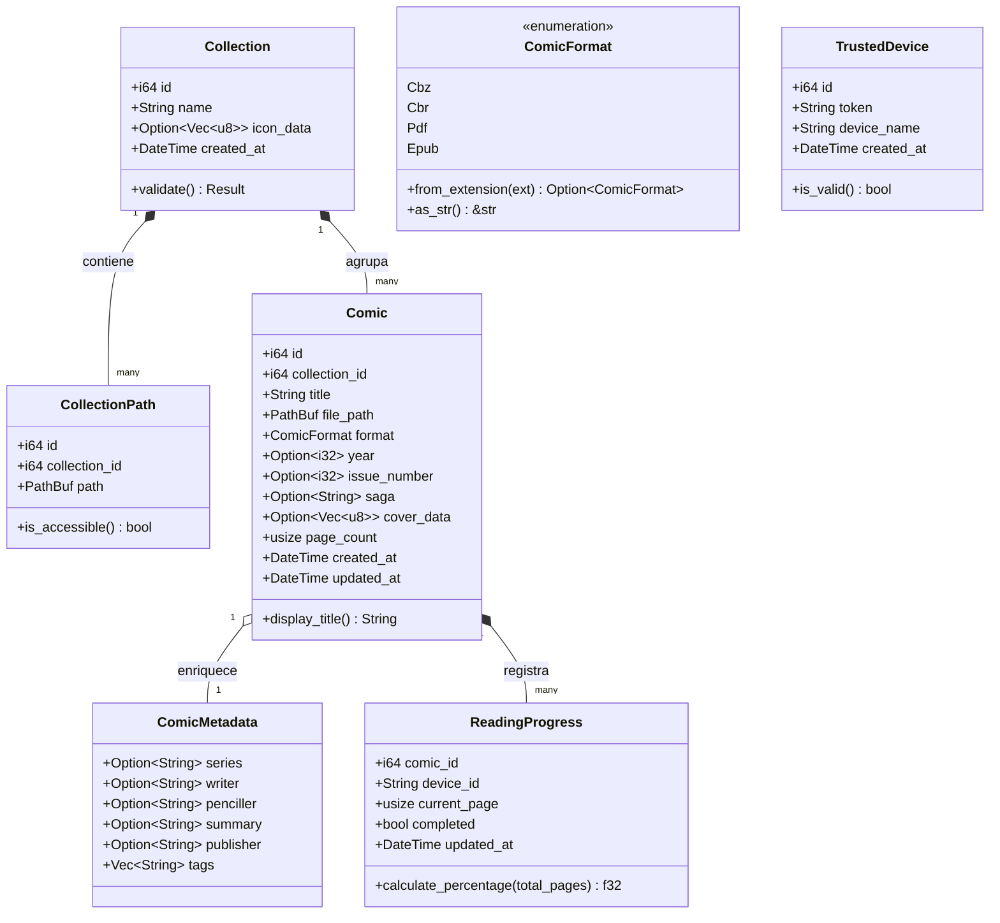

# Modelo de Datos del Dominio y Persistencia

**Feature**: `001-reorganize-app-modular`  
**Fecha**: 2026-09-15  
**Estado**: Completado  

Este documento describe las entidades del núcleo del dominio, los objetos de valor (*Value Objects*), sus invariantes de negocio y el mapeo hacia la base de datos relacional SQLite.

---

## 1. Entidades del Núcleo del Dominio (`app/src/domain/`)

Las entidades del dominio son structs puros en Rust, sin dependencias directas de frameworks web, motores gráficos o drivers de persistencia.



---

## 2. Definición Detallada de Entidades y Tipos

### A. `Comic`
Representa un volumen o número digital individual.
- **Campos**:
  - `id: i64`: Identificador único en el catálogo (0 si no está persistido).
  - `collection_id: i64`: ID de la colección a la que pertenece.
  - `title: String`: Título legible del cómic (no vacío).
  - `file_path: PathBuf`: Ruta absoluta al archivo físico en el sistema de archivos.
  - `format: ComicFormat`: Formato detectado (`Cbz`, `Cbr`, etc.).
  - `year: Option<i32>`: Año de publicación (rango válido: 1900 - 2100).
  - `issue_number: Option<i32>`: Número de edición o entrega (≥ 0).
  - `saga: Option<String>`: Nombre del arco argumental o saga.
  - `cover_data: Option<Vec<u8>>`: Miniatura procesada (JPEG 300x450).
  - `page_count: usize`: Total de páginas legibles encontradas en el archivo.
  - `created_at: DateTime<Utc>`: Marca temporal de indexación.
  - `updated_at: DateTime<Utc>`: Marca temporal de última modificación de metadatos.

### B. `Collection`
Agrupador lógico de cómics administrado por el usuario.
- **Campos**:
  - `id: i64`: Identificador único.
  - `name: String`: Nombre único descriptivo (longitud entre 1 y 100 caracteres).
  - `icon_data: Option<Vec<u8>>`: Icono personalizado 1:1 en formato binario.
  - `created_at: DateTime<Utc>`: Fecha de creación.

### C. `CollectionPath`
Vínculo entre una colección y un directorio físico monitoreado en disco.
- **Campos**:
  - `id: i64`: Identificador único.
  - `collection_id: i64`: Colección propietaria de la ruta.
  - `path: PathBuf`: Ruta canónica del directorio en disco.

### D. `ReadingProgress`
Estado de avance de lectura desacoplado por cómic y dispositivo cliente.
- **Campos**:
  - `comic_id: i64`: Identificador del cómic.
  - `device_id: String`: Identificador único del cliente o dispositivo.
  - `current_page: usize`: Índice de la última página leída (0-based).
  - `completed: bool`: Verdadero si el usuario alcanzó la última página.
  - `updated_at: DateTime<Utc>`: Marca de tiempo de la última lectura sincronizada.

### E. `TrustedDevice`
Credencial permanente para dispositivos autorizados en la red local.
- **Campos**:
  - `id: i64`: Identificador único.
  - `token: String`: Cadena alfanumérica única de 16 caracteres (UUID v4 truncado/sin guiones).
  - `device_name: String`: Nombre asignado al dispositivo (ej. "Tablet Samsung").
  - `created_at: DateTime<Utc>`: Fecha de registro.

---

## 3. Reglas de Validación e Invariantes del Negocio

1. **Unicidad de Rutas de Archivo**:
   - No puede existir más de un registro de `Comic` apuntando a la misma ruta física de archivo (`file_path`).
2. **Integridad de Rangos de Lectura**:
   - Para cualquier `ReadingProgress`, `current_page` debe ser menor que `Comic.page_count`.
3. **Persistencia Transaccional e Integridad Referencial**:
   - Si una `Collection` es eliminada, todos sus `CollectionPath`, `Comic` y registros de `ReadingProgress` asociados DEBEN ser eliminados en cascada (`ON DELETE CASCADE`).
4. **Páginas e Imágenes Válidas**:
   - Un archivo de cómic debe contener al menos 1 página de imagen reconocible (`.jpg`, `.jpeg`, `.png`, `.webp`, `.gif`, `.bmp`) para considerarse válido (`page_count > 0`).

---

## 4. Esquema Físico Relacional (SQLite)

```sql
-- Habilitar modo WAL para concurrencia masiva
PRAGMA journal_mode = WAL;
PRAGMA foreign_keys = ON;

CREATE TABLE IF NOT EXISTS collections (
    id INTEGER PRIMARY KEY AUTOINCREMENT,
    name TEXT NOT NULL,
    icon_data BLOB NULL,
    created_at DATETIME DEFAULT CURRENT_TIMESTAMP
);

CREATE TABLE IF NOT EXISTS collection_paths (
    id INTEGER PRIMARY KEY AUTOINCREMENT,
    collection_id INTEGER NOT NULL,
    path TEXT NOT NULL UNIQUE,
    FOREIGN KEY (collection_id) REFERENCES collections(id) ON DELETE CASCADE
);

CREATE TABLE IF NOT EXISTS comics (
    id INTEGER PRIMARY KEY AUTOINCREMENT,
    collection_id INTEGER NOT NULL,
    title TEXT NOT NULL,
    file_path TEXT NOT NULL UNIQUE,
    file_type TEXT NOT NULL,
    year INTEGER NULL,
    issue_number INTEGER NULL,
    saga TEXT NULL,
    cover_data BLOB NULL,
    page_count INTEGER NOT NULL DEFAULT 0,
    created_at DATETIME DEFAULT CURRENT_TIMESTAMP,
    updated_at DATETIME DEFAULT CURRENT_TIMESTAMP,
    FOREIGN KEY (collection_id) REFERENCES collections(id) ON DELETE CASCADE
);

CREATE INDEX IF NOT EXISTS idx_comics_collection ON comics(collection_id);
CREATE INDEX IF NOT EXISTS idx_comics_order ON comics(collection_id, saga, issue_number, title);

CREATE TABLE IF NOT EXISTS trusted_devices (
    id INTEGER PRIMARY KEY AUTOINCREMENT,
    token TEXT NOT NULL UNIQUE,
    device_name TEXT NOT NULL,
    created_at DATETIME DEFAULT CURRENT_TIMESTAMP
);

CREATE TABLE IF NOT EXISTS reading_progress (
    id INTEGER PRIMARY KEY AUTOINCREMENT,
    comic_id INTEGER NOT NULL,
    device_id TEXT NOT NULL,
    current_page INTEGER NOT NULL DEFAULT 0,
    completed BOOLEAN NOT NULL DEFAULT 0,
    updated_at DATETIME DEFAULT CURRENT_TIMESTAMP,
    FOREIGN KEY (comic_id) REFERENCES comics(id) ON DELETE CASCADE,
    UNIQUE(comic_id, device_id)
);
```
