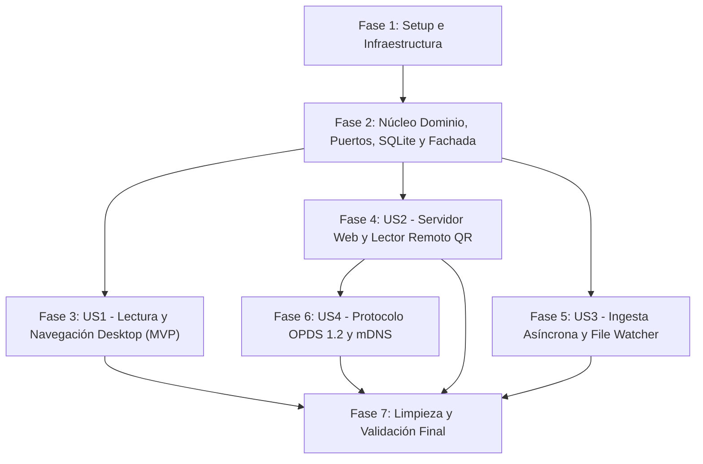

# Tareas: Reorganización Modular Hexagonal de la Aplicación

**Entrada**: Documentos de diseño desde `.specify/specs/001-reorganize-app-modular/`  
**Prerrequisitos**: `plan.md`, `spec.md`, `research.md`, `data-model.md`, `contracts/`, `quickstart.md`  
**Convención de rutas**: Todos los archivos del código fuente residen bajo `app/` según la constitución del proyecto.  
**Idioma**: 100% Español conforme a la gobernanza del proyecto.

---

## Formato: `[ID] [P?] [Story?] Descripción con ruta de archivo`

- **[P]**: Tarea paralelizable (archivos distintos, sin dependencias bloqueantes pendientes).
- **[Story]**: Etiqueta de la historia de usuario correspondiente (`[US1]`, `[US2]`, `[US3]`, `[US4]`).
- Las fases de Setup, Foundational y Polish no llevan etiqueta de historia de usuario.

---

## Fase 1: Configuración Inicial e Infraestructura Compartida (Setup)

**Propósito**: Preparar el árbol de directorios modular, las dependencias en `Cargo.toml` y los esqueletos de los módulos de la Arquitectura Hexagonal.

- [X] T001 Actualizar dependencias del proyecto agregando `notify = "6"` y `async-trait = "0.1"` en `app/Cargo.toml`
- [X] T002 Crear la estructura de directorios de capas hexagonales en `app/src/` (`domain/`, `application/`, `adapters/inbound/desktop_ui/`, `adapters/inbound/rest_api/`, `adapters/inbound/opds/`, `adapters/outbound/persistence/`, `adapters/outbound/file_readers/`, `adapters/outbound/cache/`, `ingestion/`, `network/`)
- [X] T003 [P] Configurar el punto de exportación del módulo raíz de adaptadores en `app/src/adapters/mod.rs`
- [X] T004 [P] Configurar el módulo raíz de adaptadores de salida en `app/src/adapters/outbound/mod.rs`
- [X] T005 [P] Configurar el módulo raíz de adaptadores de entrada en `app/src/adapters/inbound/mod.rs`

---

## Fase 2: Fundacional (Prerrequisitos Bloqueantes)

**Propósito**: Construir el núcleo puro de dominio, contratos de puertos, persistencia SQLite base, lectores de archivos desacoplados, proxy de caché en disco y servicios de aplicación.

**⚠️ CRÍTICO**: Ninguna historia de usuario puede completarse hasta que los contratos y adaptadores fundacionales estén operativos y compilen limpiamente.

### 2.1 Núcleo Puro del Dominio (`app/src/domain/`)
- [X] T006 Crear enumeraciones de error del dominio `DomainError` y conversiones idiomáticas en `app/src/domain/errors.rs`
- [X] T007 [P] Crear la entidad `Comic`, el enum `ComicFormat` y el struct `ComicMetadata` en `app/src/domain/comic.rs`
- [X] T008 [P] Crear las entidades `Collection` y `CollectionPath` con validaciones de negocio en `app/src/domain/collection.rs`
- [X] T009 [P] Crear la entidad `ReadingProgress` y lógica de cálculo de porcentaje en `app/src/domain/progress.rs`
- [X] T010 [P] Crear la entidad `TrustedDevice` con generación y validación de tokens en `app/src/domain/device.rs`
- [X] T011 Definir los contratos de puertos (traits `ComicFileReader`, `ComicRepository`, `CollectionRepository`, `ImageCache`) en `app/src/domain/ports.rs`
- [X] T012 Exportar y documentar las entidades y puertos del dominio en `app/src/domain/mod.rs`
- [X] T013 [P] Escribir pruebas unitarias para las entidades de dominio y validaciones en `app/src/domain/comic.rs` y `app/src/domain/collection.rs`

### 2.2 Adaptadores de Salida Fundacionales (`app/src/adapters/outbound/`)
- [X] T014 Implementar el esquema de base de datos DDL con modo WAL y claves foráneas en `app/src/adapters/outbound/persistence/schema.rs`
- [X] T015 Implementar los traits `ComicRepository` y `CollectionRepository` sobre SQLite con `sqlx` en `app/src/adapters/outbound/persistence/sqlite_repo.rs`
- [X] T016 Exportar el repositorio y schema en `app/src/adapters/outbound/persistence/mod.rs`
- [X] T017 [P] Implementar el adaptador `CbzAdapter` cumpliendo el trait `ComicFileReader` para archivos ZIP en `app/src/adapters/outbound/file_readers/cbz_adapter.rs`
- [X] T018 [P] Implementar el adaptador `CbrAdapter` cumpliendo el trait `ComicFileReader` para archivos RAR en `app/src/adapters/outbound/file_readers/cbr_adapter.rs`
- [X] T019 Implementar la factoría/despachador de lectores de archivos según formato en `app/src/adapters/outbound/file_readers/mod.rs`
- [X] T020 Implementar el proxy de almacenamiento de miniaturas y páginas en disco (`app/.cache/`) con límite de tamaño y poda en `app/src/adapters/outbound/cache/disk_cache.rs`
- [X] T021 Exportar el proxy de caché en `app/src/adapters/outbound/cache/mod.rs`

### 2.3 Capa de Aplicación y Fachada (`app/src/application/`)
- [X] T022 Implementar `CatalogService` para gestión de colecciones, rutas e indexación en `app/src/application/catalog_service.rs`
- [X] T023 Implementar `ReaderService` para extracción selectiva de páginas, escalado y gestión de progreso en `app/src/application/reader_service.rs`
- [X] T024 Implementar la fachada unificada `ComicFacade` (Patrón Fachada) consumiendo servicios y repositorios en `app/src/application/facade.rs`
- [X] T025 Exportar la fachada y servicios de aplicación en `app/src/application/mod.rs`

**Punto de Control Fundacional**: El núcleo de dominio, persistencia, lectores y fachada compilan limpiamente mediante `cargo check`. Las historias de usuario pueden ahora ser implementadas e integradas.

---

## Fase 3: Historia de Usuario 1 — Lectura y Navegación Local de Cómics sin Regresiones (Prioridad: P1) 🎯 MVP

**Objetivo**: Restaurar y modularizar completamente la experiencia de lectura de escritorio nativa en Iced (TEA), navegando colecciones, visualizando carátulas cacheadas y leyendo cómics con zoom y paneo continuo sin bloqueos del hilo de interfaz.

**Criterio de Prueba Independiente**: Compilar la aplicación de escritorio, seleccionar una colección de cómics existente, abrir un tomo `.cbz` o `.cbr` y verificar navegación con teclado/ratón, zoom entre 10% y 500% y visualización fluida (< 100 ms de respuesta) sin regresiones.

### Implementación para Historia de Usuario 1
- [X] T026 [P] [US1] Modularizar el componente lateral de colecciones conectándolo a `ComicFacade` en `app/src/adapters/inbound/desktop_ui/sidebar.rs`
- [X] T027 [P] [US1] Modularizar la cuadrícula de cómics y renderizado reactivo de miniaturas en `app/src/adapters/inbound/desktop_ui/comic_grid.rs`
- [X] T028 [US1] Modularizar el visor gráfico de lectura con zoom continuo (10%-500%), paneo por arrastre y navegación en `app/src/adapters/inbound/desktop_ui/reader.rs`
- [X] T029 [P] [US1] Modularizar el editor de metadatos de volúmenes (título, año, número, saga) en `app/src/adapters/inbound/desktop_ui/metadata_editor.rs`
- [X] T030 [P] [US1] Modularizar el editor y selector de carpetas de colección en `app/src/adapters/inbound/desktop_ui/collection_editor.rs`
- [X] T031 [US1] Consolidar y cablear los mensajes y estados de la UI de escritorio (TEA) en `app/src/adapters/inbound/desktop_ui/mod.rs`
- [X] T032 [US1] Conectar la UI de escritorio con la instancia de `ComicFacade` en el punto de entrada `app/src/main.rs`
- [X] T033 [US1] Validar que la navegación por colecciones y la lectura de páginas no presenten parpadeos ni bloqueen el hilo principal mediante `cargo check`

**Punto de Control US1 (MVP)**: La aplicación de escritorio es 100% funcional de forma independiente para catalogación y lectura nativa.

---

## Fase 4: Historia de Usuario 2 — Servidor Web Local y Lectura Remota Multidispositivo (Prioridad: P1)

**Objetivo**: Modularizar el servidor HTTP Axum, el generador de código QR y la SPA autónoma, permitiendo streaming responsivo de páginas bajo demanda y autenticación con tokens y dispositivos de confianza (`trusted_devices`).

**Criterio de Prueba Independiente**: Iniciar el servidor local desde la UI, verificar generación de código QR con IP de red local, acceder desde un navegador web remoto usando el token generado y verificar la navegación y lectura remota fluida de páginas.

### Implementación para Historia de Usuario 2
- [X] T034 [P] [US2] Migrar las utilidades de detección de IP local y renderizado matricial de código QR a `app/src/network/qr.rs`
- [X] T035 [P] [US2] Exportar utilidades de red en `app/src/network/mod.rs`
- [X] T036 [P] [US2] Implementar el middleware de autenticación por token y consulta de dispositivos de confianza en `app/src/adapters/inbound/rest_api/auth.rs`
- [X] T037 [P] [US2] Modularizar la entrega de la SPA HTML5/CSS3/JS autónoma sin CDNs (`WEB_PAGE`) en `app/src/adapters/inbound/rest_api/spa.rs`
- [X] T038 [US2] Implementar los manejadores de rutas REST (`/api/collections`, `/api/comics/:id/cover`, `/api/comics/:id/page/:page` con streaming `max_width`, `/api/comics/:id/progress`) en `app/src/adapters/inbound/rest_api/routes.rs`
- [X] T039 [US2] Configurar el router de Axum, middlewares de CORS, límites de carga y trazas en `app/src/adapters/inbound/rest_api/mod.rs`
- [X] T040 [P] [US2] Modularizar el panel de administración de dispositivos de confianza en la UI de escritorio en `app/src/adapters/inbound/desktop_ui/trusted_devices.rs`
- [X] T041 [US2] Integrar el control de inicio/parada del servidor HTTP Axum y el diálogo modal de código QR en `app/src/adapters/inbound/desktop_ui/mod.rs` y `app/src/main.rs`
- [X] T042 [US2] Validar la compilación y pruebas de endpoints REST con autenticación de tokens

**Punto de Control US2**: La lectura remota mediante navegador web y código QR opera de forma totalmente desacoplada y compatible con los clientes móviles.

---

## Fase 5: Historia de Usuario 3 — Ingesta Asíncrona, File Watcher y Extracción de Metadatos (Prioridad: P2)

**Objetivo**: Implementar el monitoreo reactivo del sistema de archivos con debouncing de 500 ms mediante `notify` (patrón Observador), extrayendo metadatos embebidos desde `ComicInfo.xml` y generando miniaturas en segundo plano con cero congelamiento de la UI.

**Criterio de Prueba Independiente**: Añadir un nuevo archivo `.cbz` con `ComicInfo.xml` a un directorio registrado y verificar que la base de datos lo indexe automáticamente en menos de 2 segundos, mostrando su título y portada en la cuadrícula sin intervención manual.

### Implementación para Historia de Usuario 3
- [X] T043 [P] [US3] Implementar el extractor y parseador XML de metadatos `ComicInfo.xml` en `app/src/ingestion/comic_info.rs`
- [X] T044 [US3] Implementar el *File Watcher* asíncrono basado en `notify` con debouncing de 500 ms y canal `tokio::sync::mpsc` en `app/src/ingestion/watcher.rs`
- [X] T045 [US3] Implementar el trabajador de ingesta asíncrono (`IngestionWorker`) con barrido inicial de arranque y procesamiento en segundo plano en `app/src/ingestion/worker.rs`
- [X] T046 [US3] Exportar y coordinar el módulo de ingesta en `app/src/ingestion/mod.rs`
- [X] T047 [US3] Conectar el trabajador de ingesta con `CatalogService` y registrar el canal de eventos hacia la UI de escritorio en `app/src/main.rs`
- [X] T048 [US3] Validar la detección reactiva de archivos y la extracción de metadatos sin regresiones en el rendimiento del hilo principal

**Punto de Control US3**: Las carpetas registradas se sincronizan automáticamente ante cambios en el disco sin requerir reescaneos manuales.

---

## Fase 6: Historia de Usuario 4 — Soporte de Protocolo Estándar OPDS y Descubrimiento mDNS (Prioridad: P3)

**Objetivo**: Proveer un feed de catálogo XML Atom conforme al estándar OPDS 1.2 (`/opds`) para lectores de cómics de terceros en iPad/Android y anunciar el servicio en la red local mediante mDNS/Zeroconf.

**Criterio de Prueba Independiente**: Consultar la URL `http://<IP>:8080/opds?token=<TOKEN>` y validar la recepción del documento XML Atom con la lista de colecciones y volúmenes, y verificar el anuncio mDNS en la red LAN.

### Implementación para Historia de Usuario 4
- [X] T049 [P] [US4] Implementar el generador de XML Atom para feeds de navegación y adquisición OPDS 1.2 en `app/src/adapters/inbound/opds/feed_builder.rs`
- [X] T050 [US4] Implementar los manejadores de rutas `/opds` y `/opds/collections/:id` en `app/src/adapters/inbound/opds/mod.rs`
- [X] T051 [US4] Vincular las rutas OPDS al servidor Axum en `app/src/adapters/inbound/rest_api/mod.rs`
- [X] T052 [P] [US4] Implementar el anunciador de servicio de red local mDNS (`_comic._tcp.local`) en `app/src/network/mdns.rs`
- [X] T053 [US4] Activar el anuncio mDNS al iniciar el servidor HTTP en `app/src/main.rs`
- [X] T054 [US4] Validar la generación y validez sintáctica del feed OPDS 1.2 Atom XML con clientes o peticiones de prueba

**Punto de Control US4**: Lectores dedicados de cómics en tabletas pueden descubrir el catálogo e importar volúmenes directamente a través de OPDS y mDNS.

---

## Fase 7: Limpieza, Refactorización Final y Validación Cruzada (Polish)

**Propósito**: Eliminar código monolítico legado redundante, verificar la rotación diaria de logs, ejecutar validaciones cruzadas y comprobar la guía de inicio rápido `quickstart.md`.

- [X] T055 Eliminar de forma segura los archivos monolíticos obsoletos de `app/src/` (`comic_reader.rs`, `db.rs`, `server.rs`, `qr.rs` legado, `ui/` legado) tras confirmar migración total a las nuevas capas
- [X] T056 [P] Configurar el subsistema de logging con rotación diaria automática en `app/log/comic.YYYY-MM-DD.log` mediante `tracing-appender` en `app/src/main.rs`
- [X] T057 Ejecutar `cargo check` y `cargo test` asegurando compilación limpia con 0 advertencias críticas y pruebas de dominio superadas
- [X] T058 Ejecutar y documentar los 5 escenarios de validación de extremo a extremo definidos en `quickstart.md`
- [X] T059 Actualizar la documentación de arquitectura y README del proyecto reflejando la nueva estructura hexagonal

---

## Dependencias y Orden de Ejecución

### Dependencias entre Fases
1. **Fase 1 (Setup)**: Puede comenzar de inmediato sin dependencias.
2. **Fase 2 (Foundational)**: Depende de Fase 1. **BLOQUEA** todas las historias de usuario.
3. **Fase 3 (US1 - MVP)**: Depende de Fase 2. Puede implementarse de forma inmediata como primer incremento entregable.
4. **Fase 4 (US2)**: Depende de Fase 2. Se integra con la UI de escritorio para activación del servidor.
5. **Fase 5 (US3)**: Depende de Fase 2. Se conecta reactivamente con `CatalogService` y la UI.
6. **Fase 6 (US4)**: Depende de Fase 2 y Fase 4 (se monta sobre el servidor Axum).
7. **Fase 7 (Polish)**: Depende de la finalización de todas las historias de usuario.

---

## Oportunidades de Ejecución en Paralelo

- **En Fase 1**: T003, T004, T005 pueden crearse en paralelo una vez configurado el árbol de carpetas (T002).
- **En Fase 2**:
  - Entidades de dominio T007, T008, T009, T010 pueden construirse concurrentemente en archivos independientes.
  - Lectores de archivo T017 (`cbz_adapter.rs`) y T018 (`cbr_adapter.rs`) pueden desarrollarse en paralelo.
  - El proxy de caché T020 puede programarse en paralelo a los lectores.
- **En Fase 3 (US1)**: T026 (`sidebar.rs`), T027 (`comic_grid.rs`), T029 (`metadata_editor.rs`) y T030 (`collection_editor.rs`) pueden modularizarse en paralelo.
- **En Fase 4 (US2)**: T034 (`qr.rs`), T036 (`auth.rs`) y T037 (`spa.rs`) pueden implementarse en paralelo.
- **En Fase 5 (US3)**: T043 (`comic_info.rs`) puede construirse en paralelo al *watcher* T044.
- **En Fase 6 (US4)**: T049 (`feed_builder.rs`) y T052 (`mdns.rs`) son paralelizables.

---

## Estrategia de Entrega Incremental

### 1. MVP Primero (Historias de Usuario Fundacionales y US1)
1. Completar **Fase 1 (Setup)** y **Fase 2 (Foundational)**.
2. Completar **Fase 3 (Historia de Usuario 1 - Desktop UI)**.
3. **DETENER Y VALIDAR**: Ejecutar `cargo check` y compilar el binario nativo. Verificar que la lectura de cómics, el zoom y el catálogo funcionen exactamente igual o mejor que antes.

### 2. Incremento Remoto (US2)
4. Implementar **Fase 4 (Historia de Usuario 2 - Servidor Web y QR)**.
5. Validar la lectura en teléfonos móviles y tabletas conectadas a la red local.

### 3. Incremento Reactivo (US3)
6. Implementar **Fase 5 (Historia de Usuario 3 - File Watcher e Ingesta Asíncrona)**.
7. Validar adición en caliente de cómics y extracción de `ComicInfo.xml`.

### 4. Incremento de Ecosistema (US4)
8. Implementar **Fase 6 (Historia de Usuario 4 - OPDS 1.2 y mDNS)**.
9. Validar catálogo Atom XML en lectores móviles estándar.

### 5. Consolidación Final (Polish)
10. Ejecutar **Fase 7**: Limpiar código obsoleto, asegurar rotación de logs y verificar `quickstart.md`.
