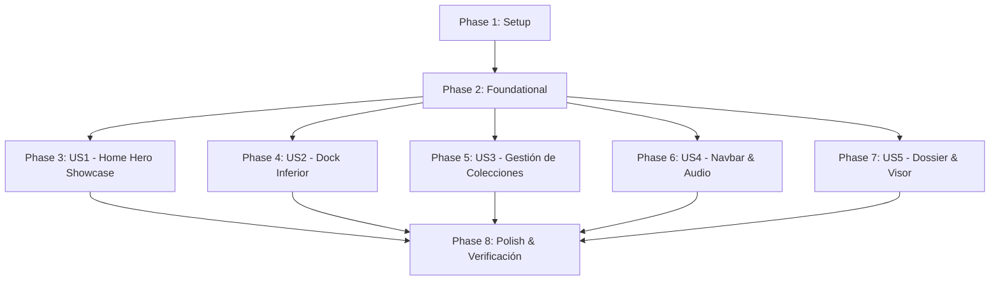

# Tasks: Adopción de Tauri y Nueva Interfaz Gráfica Comic Showcase

**Input**: Documentos de diseño de `.specify/specs/003-tauri-hero-interface/` (`spec.md`, `plan.md`, `research.md`, `data-model.md`, `contracts/tauri-commands.contract.md`, `quickstart.md`).

**Organization**: Tareas organizadas por fases y por historias de usuario para implementación y validación independiente.

---

## Phase 1: Setup (Infraestructura Compartida)

**Propósito**: Configuración de dependencias de Tauri v2 y estructura del frontend local.

- [x] T001 Configurar dependencias de Tauri v2 (`tauri`, `tauri-build`, `serde`, `serde_json`) en `app/Cargo.toml` y `app/build.rs`
- [x] T002 Crear configuración de Tauri `app/tauri.conf.json` con ventana maximizada, CSP local estricto y directorio frontend `app/ui/`
- [x] T003 [P] Crear estructura del frontend local en `app/ui/` y copiar assets base desde `docs/example/assets/` a `app/ui/assets/`
- [x] T004 [P] Empaquetar fuentes locales (Bebas Neue, Montserrat, Inter) en `app/ui/assets/fonts/` y vincular `@font-face` en `app/ui/styles.css`

---

## Phase 2: Foundational (Dominio, Persistencia y Puente IPC)

**Propósito**: Infraestructura central que DEBE completarse antes de las historias de usuario.

**⚠️ CRÍTICO**: Ninguna historia de usuario puede implementarse antes de este checkpoint.

- [x] T005 Modificar entidad `Collection` en `app/src/domain/collection.rs` para soportar el campo `protagonist: Option<String>` y sus invariantes de validación
- [x] T006 [P] Actualizar migración idempotente de base de datos en `app/src/adapters/outbound/persistence/schema.rs` para la columna `protagonist`
- [x] T007 Actualizar métodos del repositorio SQLite en `app/src/adapters/outbound/persistence/sqlite_repo.rs` (`get_all`, `get_by_id`, `get_recent`, `create_with_details`, `update`) para `protagonist`
- [x] T008 [P] Actualizar puertos y servicios en `app/src/domain/ports.rs`, `app/src/application/catalog_service.rs` y `app/src/application/facade.rs`
- [x] T009 Crear módulo adaptador de entrada `app/src/adapters/inbound/tauri_bridge/mod.rs` y `commands.rs` con el registro de comandos `#[tauri::command]`
- [x] T010 Configurar el builder y runtime de Tauri en `app/src/main.rs` conectando la persistencia y `ComicFacade` con el manejador IPC

**Checkpoint**: Fundación lista - la implementación de historias de usuario puede comenzar.

---

## Phase 3: User Story 1 - Experiencia Visual Home Hero Showcase estilo Cómic (Priority: P1) 🎯 MVP

**Objetivo**: Pantalla principal con diseño de cómic inmersivo, escenario del personaje, bloque de protagonista rojo en relieve, caja de sinopsis y soporte para estado inicial limpio.

**Prueba Independiente**: Abrir la aplicación y verificar que se renderice el cartel rojo con el protagonista de la colección activa, el arte del personaje, la sinopsis y el fondo temático, o el estado inicial limpio si no hay colecciones.

- [x] T011 [P] [US1] Adaptar estructura HTML del Hero Showcase en `app/ui/index.html` (escenario de personaje, bloque de título rojo con relieve, caja de sinopsis Glassmorphism, botón CTA, overlays halftone y canvas glitch)
- [x] T012 [P] [US1] Adaptar estilos CSS de cómic dinámico, tipografía local y efectos 3D en `app/ui/styles.css`
- [x] T013 [US1] Implementar comandos Tauri `get_collections` y `get_collection` en `app/src/adapters/inbound/tauri_bridge/commands.rs`
- [x] T014 [US1] Implementar renderizado dinámico del protagonista, sinopsis y personaje en `app/ui/script.js` con soporte para estado limpio inicial (sin colecciones)
- [x] T015 [US1] Integrar pruebas unitarias de dominio y persistencia para la carga de colecciones y protagonista en `app/src/domain/collection.rs` y `app/src/adapters/outbound/persistence/sqlite_repo.rs`

**Checkpoint**: User Story 1 completamente funcional y verificable como MVP.

---

## Phase 4: User Story 2 - Dock Inferior de Selección Rápida con Scroll Continuo (Priority: P2)

**Objetivo**: Barra flotante inferior que exhibe tarjetas con miniaturas y nombres de colecciones con desplazamiento horizontal interactivo y conmutación fluida.

**Prueba Independiente**: Crear múltiples colecciones y alternar entre ellas desde el Dock inferior, comprobando el cambio instantáneo de protagonista, sinopsis y arte.

- [x] T016 [P] [US2] Estructurar el contenedor del Dock flotante en `app/ui/index.html`
- [x] T017 [P] [US2] Implementar estilos de tarjetas iluminadas, hover dinámico y scroll horizontal continuo en `app/ui/styles.css`
- [x] T018 [US2] Implementar lógica de interacción en `app/ui/script.js` para conmutar la colección activa al hacer clic, con animación fluida y soporte para arrastre/rueda del ratón

**Checkpoint**: User Stories 1 y 2 operativas de manera independiente.

---

## Phase 5: User Story 3 - Gestión de Colecciones con Campo de Protagonista (Priority: P3)

**Objetivo**: Crear y editar colecciones incorporando el nombre del protagonista principal ("SPIDER-MAN", "BATMAN", etc.), sinopsis y selectores de imagen locales.

**Prueba Independiente**: Crear una colección indicando un protagonista personalizado y verificar que se persista en SQLite y se visualice en el bloque rojo del Home.

- [x] T019 [P] [US3] Estructurar la ventana modal de creación y edición de colecciones en `app/ui/index.html` incluyendo el campo de entrada "Protagonista / Héroe"
- [x] T020 [P] [US3] Implementar estilos del diálogo modal de colección y validación visual en `app/ui/styles.css`
- [x] T021 [US3] Implementar comandos Tauri `save_collection`, `delete_collection` y selector de archivos nativo `pick_image_file` en `app/src/adapters/inbound/tauri_bridge/commands.rs`
- [x] T022 [US3] Conectar el formulario de colección en `app/ui/script.js` para crear y editar colecciones con su protagonista y recargar la vista reactivamente

**Checkpoint**: User Stories 1, 2 y 3 operativas de manera independiente.

---

## Phase 6: User Story 4 - Barra Superior Unificada con Navbar y Conmutador de Audio (Priority: P4)

**Objetivo**: Barra superior fija que integra navegación `HOME`, menús desplegables (`COLECCIONES`, `CÓMICS`, `SERVIDOR / QR`) y conmutador de efectos de audio de cómic.

**Prueba Independiente**: Probar la interacción con cada menú del Navbar (re-escaneo, servidor local, código QR, dispositivos de confianza) y el botón de silencio/sonido.

- [x] T023 [P] [US4] Estructurar el Navbar superior en `app/ui/index.html` con menús desplegables (`HOME`, `COLECCIONES ▾`, `CÓMICS ▾`, `SERVIDOR / QR ▾`) y botón de conmutador de audio
- [x] T024 [P] [US4] Implementar estilos de menús desplegables, sombras y estados activos en `app/ui/styles.css`
- [x] T025 [US4] Implementar comandos Tauri para escaneo de carpetas (`scan_monitored_paths`), servidor local (`get_server_status`, `toggle_server`) y dispositivos de confianza (`get_trusted_devices`, `add_trusted_device`, `remove_trusted_device`) en `app/src/adapters/inbound/tauri_bridge/commands.rs`
- [x] T026 [US4] Conectar los modales de escaneo, código QR de servidor y dispositivos de confianza en `app/ui/script.js`
- [x] T027 [US4] Implementar sintetizador de efectos de audio de cómic Web Audio con control de silencio (Mute/Unmute) en `app/ui/script.js`

**Checkpoint**: User Stories 1, 2, 3 y 4 operativas de manera independiente.

---

## Phase 7: User Story 5 - Dossier Detallado y Visor de Lectura de Cómics (Priority: P5)

**Objetivo**: Modal de Dossier clasificado al presionar "READ MORE" y visor de lectura acelerado de cómics.

**Prueba Independiente**: Presionar "READ MORE" en la colección activa para abrir el Dossier e iniciar la lectura de un cómic con navegación entre páginas.

- [x] T028 [P] [US5] Estructurar el diálogo modal tipo Dossier y la capa del visor de lectura en `app/ui/index.html`
- [x] T029 [P] [US5] Implementar estilos del Dossier clasificado y controles del visor de lectura en `app/ui/styles.css`
- [x] T030 [US5] Implementar comandos Tauri `get_comics_by_collection` y `get_comic_page` en `app/src/adapters/inbound/tauri_bridge/commands.rs`
- [x] T031 [US5] Implementar apertura de Dossier y navegación de páginas de cómic con teclado y zoom en `app/ui/script.js`

**Checkpoint**: Todas las historias de usuario integradas y operativas.

---

## Phase 8: Polish & Cross-Cutting Concerns

**Propósito**: Limpieza de código, optimizaciones de rendimiento y verificación integral.

- [x] T032 [P] Limpiar código, eliminar módulos obsoletos de UI no utilizados y optimizar imports en `app/src/`
- [x] T033 Ejecutar `cargo test` para verificar que todas las pruebas unitarias y de persistencia pasen con 0 fallos
- [x] T034 Ejecutar validación end-to-end de arranque y flujos según `quickstart.md` (`cargo tauri dev` / `cargo run`)

---

## Dependencies & Execution Order

---

## Implementation Strategy

1. **MVP Inmediato (US1)**: Completar Setup (Fase 1) + Foundational (Fase 2) + US1 (Fase 3) para tener la ventana principal de Tauri con el diseño cómic y el bloque de protagonista operativo.
2. **Entrega Incremental**:
   - Agregar el Dock inferior con scroll continuo (US2).
   - Agregar el modal de creación de colecciones con campo de protagonista (US3).
   - Agregar el Navbar con menús de escaneo, servidor QR y audio (US4).
   - Agregar el modal de Dossier y el visor de cómics (US5).
   - Ejecutar la fase de pulido y validación final (Fase 8).
