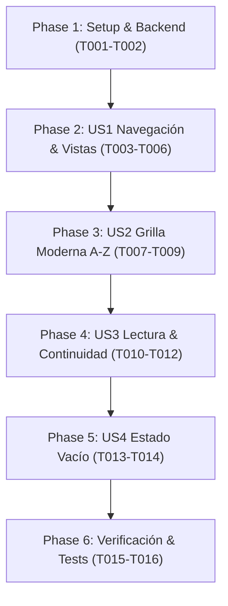

# Tasks: Vista de Cómics de Colección y Lectura Integrada (004-collection-comics-view)

**Input**: Design documents from `.specify/specs/004-collection-comics-view/`  
**Prerequisites**: `spec.md`, `plan.md`, `research.md`, `data-model.md`, `contracts/tauri-ipc-contracts.md`, `quickstart.md`

## Format: `[ID] [P?] [Story] Description`
- **[P]**: Tareas que pueden ejecutarse en paralelo (archivos distintos sin dependencias directas).
- **[Story]**: Historia de usuario a la que pertenece la tarea (US1, US2, US3, US4).
- Rutas exactas a archivos incluidas en cada descripción.

---

## Phase 1: Setup & Foundational (Prerrequisitos del Backend)

**Propósito**: Garantizar que el repositorio de datos y los comandos IPC entreguen los cómics ordenados y con portadas optimizadas.

- [X] T001 Asegurar orden alfabético ascendente en la consulta SQL de cómics por colección (`ORDER BY title COLLATE NOCASE ASC`) en `app/src/adapters/outbound/persistence/sqlite_repo.rs`.
- [X] T002 [P] Optimizar el mapeo de `ComicSummaryDto` y la entrega de miniaturas de portada en `app/src/adapters/inbound/tauri_bridge/commands.rs`.

**Checkpoint**: Backend listo para alimentar la vista de catálogo con cómics ordenados.

---

## Phase 2: User Story 1 - Navegación a la Vista de Cómics de la Colección (Priority: P1) 🎯 MVP

**Objetivo**: Permitir que al presionar "LEER MÁS" o una colección en el Navbar, la interfaz transicione de forma integrada hacia la vista dedicada de cómics.

**Prueba Independiente**: Al hacer clic en "LEER MÁS" o en una colección en el menú superior, el Hero Showcase se oculta y se visualiza `#collection-comics-view` con botón "← Volver al Inicio".

- [X] T003 [US1] Estructurar el contenedor HTML de la vista `#collection-comics-view` con barra de cabecera de la saga, botón "← Volver al Inicio", sinopsis y contenedor de grilla en `app/ui/index.html`.
- [X] T004 [P] [US1] Crear las reglas CSS de transición y visibilidad para alternar entre `#hero-main-container` y `#collection-comics-view` en `app/ui/styles.css`.
- [X] T005 [US1] Implementar la función `showCollectionComicsView(collectionId)` y la función `showHomeView()` en `app/ui/script.js`.
- [X] T006 [US1] Vincular el botón "LEER MÁS" (`#read-more-btn`) y los enlaces del menú "COLECCIONES" (`#nav-collections-menu`) para invocar `showCollectionComicsView` en `app/ui/script.js`.

**Checkpoint**: Navegación fluida y bidireccional entre Inicio y Vista de Cómics operativa.

---

## Phase 3: User Story 2 - Grilla Moderna y Sobria de Portadas (Priority: P1)

**Objetivo**: Presentar los tomos en una grilla moderna inspirada en lectores de manga/cómics profesionales con portadas 2:3, chips superpuestos y ordenamiento alfabético A-Z.

**Prueba Independiente**: Cargar una colección con varios tomos; la grilla los muestra alineados alfabéticamente con microinteracciones hover y badges sobre la portada.

- [X] T007 [P] [US2] Diseñar la grilla responsiva `.comics-catalog-grid` y tarjetas `.comic-card` con proporción vertical 2:3 en `app/ui/styles.css`.
- [X] T008 [P] [US2] Diseñar los chips/badges superpuestos (`.comic-chip-issue`, `.comic-chip-pages`) y estilos de texto truncado a 40 caracteres en `app/ui/styles.css`.
- [X] T009 [US2] Implementar la función de renderizado `renderCollectionComicsGrid(comics)` con ordenamiento natural A-Z (`localeCompare`) y badges dinámicos en `app/ui/script.js`.

**Checkpoint**: Grilla de cómics moderna, sobria y ordenada alfabéticamente renderizada con éxito.

---

## Phase 4: User Story 3 - Lectura Inmediata y Continuidad de Tomos (Priority: P1)

**Objetivo**: Abrir el lector a pantalla completa al pulsar cualquier cómic y ofrecer continuidad al finalizar el tomo.

**Prueba Independiente**: Hacer clic en una tarjeta de la grilla abre el lector en la primera página; al llegar al final se ofrece continuar al siguiente tomo.

- [X] T010 [US3] Conectar el evento de clic en cada tarjeta de cómic para invocar `openReader(comicId, title)` en `app/ui/script.js`.
- [X] T011 [US3] Implementar panel de finalización de lectura al alcanzar la última página con botón para saltar al siguiente tomo de la colección en `app/ui/script.js` e `app/ui/index.html`.
- [X] T012 [US3] Configurar retorno limpio a la grilla de la colección al cerrar el visor con la tecla `Escape` o botón de cierre en `app/ui/script.js`.

**Checkpoint**: Experiencia de lectura completa y navegación continua entre tomos validada.

---

## Phase 5: User Story 4 - Estado Vacío y Re-escaneo Rápido (Priority: P2)

**Objetivo**: Guiar al usuario si la colección no contiene cómics indexados con un panel de re-escaneo directo.

**Prueba Independiente**: Abrir una colección con 0 cómics; se presenta un estado informativo con botón para re-escanear la carpeta.

- [X] T013 [P] [US4] Estructurar el panel visual de estado vacío `.collection-empty-comics` en `app/ui/index.html` y `app/ui/styles.css`.
- [X] T014 [US4] Conectar el botón de re-escaneo a `scan_monitored_paths` con recarga automática de la grilla en `app/ui/script.js`.

**Checkpoint**: Manejo de colecciones vacías e indexación reactiva concluido.

---

## Phase 6: Polish & Verification

**Propósito**: Verificación de calidad, compilación de Rust y pruebas de extremo a extremo.

- [X] T015 [P] Ejecutar la suite de pruebas unitarias con `cargo test` para confirmar 0 errores de compilación o regresiones.
- [X] T016 Validar manualmente los 4 escenarios descritos en `.specify/specs/004-collection-comics-view/quickstart.md`.

---

## Dependencies & Completion Order

---

## Implementation Strategy

1. **Incremento MVP (Fases 1 y 2)**: Navegación funcional entre Inicio y la Vista de Cómics.
2. **Incremento Visual y Catálogo (Fase 3)**: Grilla moderna, portadas 2:3 y badges superpuestos en orden A-Z.
3. **Incremento de Lectura (Fase 4)**: Apertura inmediata de tomos y flujo continuo de siguiente entrega.
4. **Resiliencia y Pruebas (Fases 5 y 6)**: Estados vacíos, re-escaneo y validación con `cargo test`.
